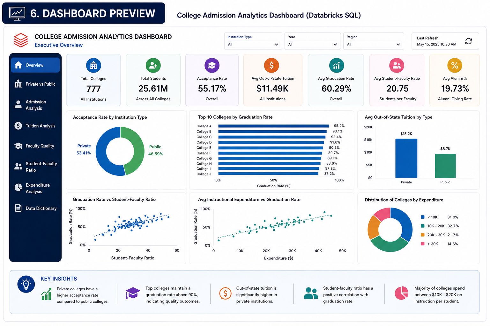

# 🎓 College Admission Analytics Pipeline

<p align="center">


</p>

---

# 📖 Project Overview

This project demonstrates an end-to-end College Admission Analytics solution built using the Databricks Lakehouse Platform.

The pipeline follows the Medallion Architecture (Bronze → Silver → Gold) to transform raw institutional data into trusted analytical datasets. The curated Gold Layer powers an interactive business intelligence dashboard that enables educational stakeholders to monitor admissions, institutional performance, faculty quality, tuition trends, and graduation outcomes.

The project showcases enterprise data engineering concepts including:

- Medallion Architecture
- ETL Pipeline Development
- Data Cleaning & Transformation
- Gold Layer Data Modeling
- Dashboard Development
- Business Insight Generation

---

# 🎯 Business Problem

Educational institutions collect large volumes of admission and academic performance data, but raw datasets alone provide limited value for decision-making.

Administrators often struggle to answer questions such as:

- Which colleges have the highest graduation success?
- Does tuition affect graduation rates?
- How does faculty quality impact student outcomes?
- Are private institutions performing better than public institutions?
- Which factors influence admission selectivity?

This project converts raw educational data into meaningful business intelligence through a scalable Medallion Architecture.

---

# 🎯 Project Objectives

- Analyze college admission trends
- Compare private and public institutions
- Evaluate faculty quality
- Analyze tuition distribution
- Measure graduation performance
- Study institutional expenditure
- Build interactive executive dashboards

---

# 📂 Dataset Overview

The dataset contains information for **777 colleges** including admissions, tuition, expenditure, faculty quality, and graduation statistics.

### Admission Metrics

- Applications Received
- Applications Accepted
- Students Enrolled

### Academic Quality

- Top 10% Students
- Top 25% Students
- Faculty with PhD
- Faculty with Terminal Degree

### Financial Metrics

- Out-of-State Tuition
- Room & Board
- Books
- Personal Expenses
- Instructional Expenditure

### Student Metrics

- Full-time Undergraduates
- Part-time Undergraduates
- Student-Faculty Ratio
- Alumni Donation Percentage

### Outcome Metrics

- Graduation Rate

---

# 🏗 Medallion Architecture

The pipeline follows a three-layer Medallion Architecture.

```
Source Data
      │
      ▼
 Bronze Layer
      │
      ▼
 Silver Layer
      │
      ▼
  Gold Layer
      │
      ▼
 Databricks Dashboard
```

📄 Detailed Architecture

docs/medallion_architecture.md

---

# ⚙️ Technology Stack

| Component | Technology |
|------------|------------|
| Platform | Databricks |
| Language | PySpark |
| Query Engine | Spark SQL |
| Storage | Delta Lake |
| Catalog | Unity Catalog |
| Dashboard | Databricks Dashboard |
| Version Control | GitHub |

---

# 🥇 Gold Layer Tables

| Table | Description |
|---------|------------|
| gold_overview_college | Executive KPI metrics |
| gold_private | Private vs Public comparison |
| gold_admission | Admission analytics |
| gold_tuition | Tuition analysis |
| gold_faculty | Faculty quality metrics |
| gold_ratio | Student-Faculty ratio analysis |
| gold_expend | Expenditure analytics |

---

# 📊 Dashboard

### Executive Dashboard

<p align="center">

</p>

---

# 📈 Business Questions Answered

- Which colleges have the highest graduation rates?
- How does tuition affect graduation success?
- Does faculty quality improve student outcomes?
- Which institutions are highly selective?
- How do private and public colleges compare?
- How does institutional expenditure impact graduation?

---

# 📌 Key Insights

- Institutions with higher instructional expenditure generally achieve better graduation rates.
- Faculty qualification has a positive relationship with student success.
- Private colleges charge higher tuition but often demonstrate stronger academic outcomes.
- Lower student-faculty ratios contribute to improved graduation performance.
- Admission selectivity reflects overall institutional competitiveness.

---

# 📁 Repository Structure

```text
College-Admission-Analytics/
│
├── architecture/
├── dashboard_screenshots/
├── datasets/
├── notebooks/
├── jobs/
├── docs/
└── README.md
```

---

# 🚀 Future Improvements

- Incremental ETL Pipeline
- Job Automation
- CI/CD Deployment
- Real-time Data Ingestion
- ML-based Graduation Prediction
- Data Quality Monitoring

---

# 👨‍💻 Author

**Apoorv Prakash Gupta**

Data Engineering | Databricks | PySpark | SQL | Delta Lake
