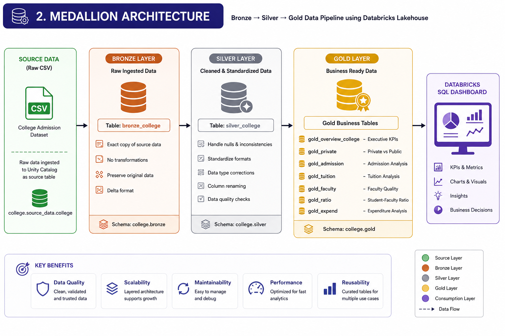
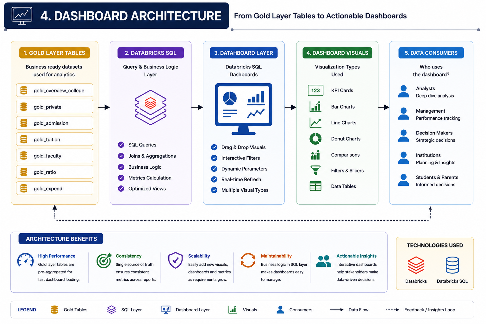

# Architecture Diagrams

This folder contains the architectural diagrams used throughout the project documentation.

---

## Medallion Architecture

Illustrates the Bronze → Silver → Gold data transformation pipeline.

---

## Dashboard Architecture

Shows how Gold Layer tables feed the Databricks SQL Dashboard.

---

## End-to-End Workflow

Displays the complete analytical workflow from raw dataset ingestion to business dashboards.

